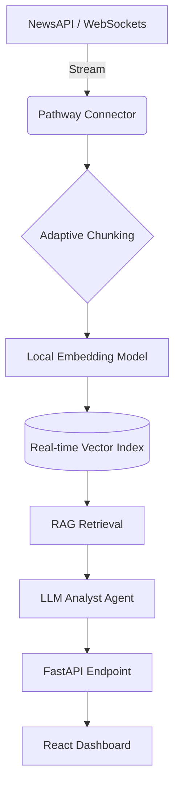

# AlphaStream Live AI

**Real-Time Financial Intelligence for the Modern Age.**

AlphaStream is a live, streaming AI agent that solves the "stale knowledge" problem in financial trading. By leveraging **Pathway's** streaming engine, it ingests real-time news and market data, processes it via an adaptive RAG pipeline, and uses LLM agents to generate instant trading recommendations with sub-second latency.


## 🚀 Key Features

*   **Real-Time Ingestion**: Connects to live financial news streams (NewsAPI) and market data.
*   **Streaming RAG**: Uses Pathway toChunk, embed, and index data on the fly — no batch jobs.
*   **Live Sentiment Analysis**: Multi-agent system analyzes market sentiment instantly.
*   **Bloomberg-Style Dashboard**: A premium, dark-themed React UI for professional traders.
*   **Privacy-First**: Local embedding generation options to minimize API costs and latency.

## 🛠️ Technology Stack

*   **Engine**: [Pathway](https://pathway.com/) (Streaming data processing & RAG)
*   **Backend**: FastAPI, Uvicorn, Python 3.11
*   **AI/LLM**: OpenRouter (Claude 3.5 Sonnet / Qwen), HuggingFace Embeddings (local)
*   **Frontend**: React, Vite, Tailwind CSS v4, Shadcn UI, Zustand
*   **Infrastructure**: Docker-ready, local CPU/GPU support

## ⚡ Quick Start

### Prerequisites
*   Python 3.11
*   Node.js & npm
*   Valid API Keys: OpenRouter (optional for local LLMs), NewsAPI.org

### 1. Setup Backend
The project uses a local virtual environment for stability.

```bash
# Activate the environment
source .venv/bin/activate

# Install dependencies (CPU-optimized)
uv pip install -e .

# Install local embedding support (required for offline RAG)
uv pip install sentence-transformers --python .venv/bin/python
```

### 2. Configure Environment
Create a `.env` file from the example:

```bash
cp .env.example .env
# Edit .env and add your API keys
```

### 3. Run the System
You need two terminals:

**Terminal 1: Backend API**
```bash
source .venv/bin/activate
python -m uvicorn src.api.app:app --host 0.0.0.0 --port 8000 --reload
```

**Terminal 2: Frontend Dashboard**
```bash
cd frontend
npm run dev -- --host
```

Access the dashboard at **http://localhost:5173**.

## 🏗️ Architecture



## 📝 Development Plan

- [x] **Stage 1: Foundation (MVP)** - Core pipeline, API, and UI.
- [ ] **Stage 2: Enhanced RAG** - Hybrid search, reranking, and improved chunking.
- [ ] **Stage 3: Multi-Agent System** - Analyst, Risk, and Decision agents.
- [ ] **Stage 4: Real-Time Polish** - WebSockets for live UI updates.

## 📄 License
MIT License. Built for DataQuest 2026.
