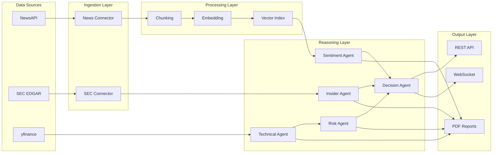

# AlphaStream Architecture

Detailed technical architecture for the AlphaStream Live AI trading system.

---

## System Overview

AlphaStream implements a **streaming RAG (Retrieval-Augmented Generation)** architecture with **multi-agent reasoning**. The system is designed for:

1. **Real-time data ingestion** - No batch processing
2. **Incremental updates** - Knowledge base updates in <1 second
3. **Explainable AI** - Track which sources influenced decisions
4. **Production-ready** - Rate limiting, error handling, fallbacks

---

## Data Flow



---

## Component Architecture

### 1. Pathway Streaming Engine

The core of AlphaStream uses Pathway for:
- **Streaming ingestion** via custom Python connector
- **Incremental indexing** - Updates propagate automatically
- **Unified batch/stream** - Same code for development and production

```python
# Pathway table streams data continuously
news_table = pw.python.read(NewsConnector(), schema=NewsSchema)
```

### 2. RAG Pipeline

**Chunking Strategy:**
- Sentence-based with semantic boundaries
- ~300 tokens per chunk for optimal retrieval
- Metadata enrichment (source, date, tickers)

**Retrieval:**
- Dense retrieval (sentence-transformers embeddings)
- Sparse retrieval (BM25)
- Reciprocal Rank Fusion (RRF) for combining scores
- Cross-encoder reranking (optional)

### 3. Agent System

Each agent is a specialized LangChain chain:

| Agent | Input | Output | Technology |
|-------|-------|--------|------------|
| Sentiment | Articles | Score (-1 to +1), Label | LangChain + OpenAI |
| Technical | Ticker | Score, RSI, SMA | yfinance + numpy |
| Risk | Technical data | Position size, Stop loss | Volatility calculation |
| Insider | Ticker | Score, Transactions | edgartools + LLM |
| Decision | All agents | BUY/HOLD/SELL | LangChain + OpenAI |

**Agent Communication:**
```
Sentiment ─┐
           │
Technical ─┼─► Decision Agent ─► Recommendation
           │
Risk ──────┤
           │
Insider ───┘
```

### 4. API Layer

FastAPI with:
- **REST endpoints** for synchronous queries
- **WebSocket** for real-time pushes
- **CORS** enabled for frontend
- **Connection Manager** for broadcast

### 5. Frontend

React SPA with:
- **Zustand** for state management
- **WebSocket** for live updates
- **Shadcn UI** components
- **Tailwind CSS** styling

---

## Security Considerations

1. **API Keys** - Never committed to git (`.gitignore`)
2. **Rate Limiting** - SEC fair access (10 req/sec)
3. **Input Validation** - Pydantic models
4. **Error Handling** - Graceful fallbacks

---

## Performance Characteristics

| Metric | Value |
|--------|-------|
| Article ingestion | <100ms |
| Full recommendation | ~10s (LLM bound) |
| Chart generation | ~2s |
| PDF report | ~15s |
| WebSocket latency | <50ms |

---

## Deployment Options

### Local Development
```bash
uv run uvicorn src.api.app:app --reload
```

### Docker
```bash
docker-compose up
```

### Production
- Use gunicorn with uvicorn workers
- Enable persistence for fault tolerance
- Configure logging for monitoring
